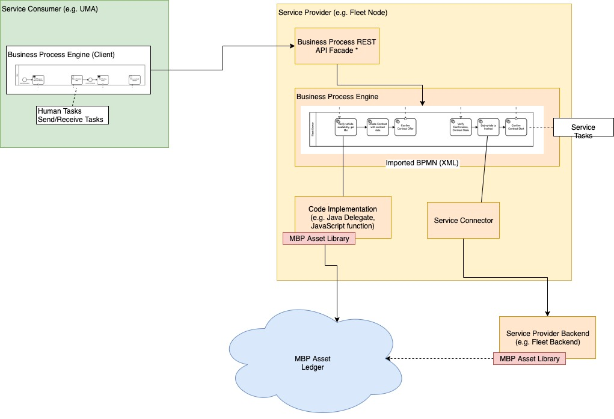

# BloXmove Dev : Business Process Modeling and Engine
In order to establish a common language between business and technical implementation, as well as improve the structure, maintainability and re-usability of the source code, a business process execution engine can be used to orchestrate the main business logic based on workflows modelled in the BPMN 2.0 (<https://www.omg.org/spec/BPMN/2.0/About-BPMN/>) notation.

## Architecture Principle
The following diagram shows the usage of a business process engine in the context of the Fleet2Share scenario: both Service Consumer (User Mobility App) and Service Provider (Fleet Node) have a business process engine embedded. The Service Consumer basically triggers the Human Tasks and exchanges messages with the Service Provider part of the process, which could be routed through some REST API Facade on the Service Provider side.

The main business logic is realised by Service Tasks in the process of the Service Provider. The Service Tasks can be implemented by code running on the same machine, or by calling remote (micro-)services via a service connector. This allows to provide predefined building blocks of task implementations or service calls that can be re-used in many business processes.

The BPMN diagram is modelled graphically using a tool like [Camunda Modeler](https://camunda.com/download/modeler/), which includes references of tasks to particular implementation classes, functions, or service calls. It is then exported as an XML document which can be imported to the business process engine, and executed assumed that all referenced implementations and service connectors are available in the context of the execution engine.

## Points of Discussion
- Protocol to communicate between participants of the process
  -   Synchronous HTTP (REST, GraphQL)
  -   Synchronous WebSockets
  -   Asynchronous Messages (WebSockets, Message Queue)
- Particular implementation of business process engine
  -   Basically all enterprise BPMN engines are based on Java (most prominent Camunda), would require to migrate most of the MBP stack to Java if Service Tasks should be implemented with code
  -   Alternative would be to use a stand-alone BPMN engine as a pure service orchestrator, e.g. Zeebe, and provide the required steps as micro-service operations
  -   There is a BPMN engine implementation in JavaScript (https://www.npmjs.com/package/bpmn-engine), however this seems to be a rather lightweight single-maintainer project that should be carefully evaluated before usage in an enterprise context

